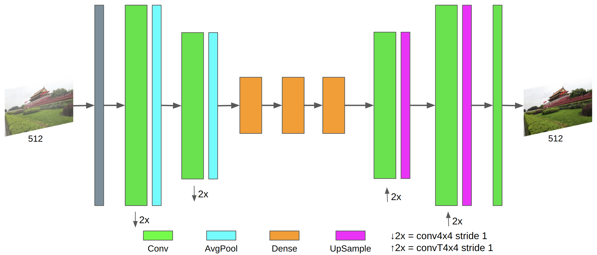

# Image Dehazing Using a Simple Convolutional Autoencoder

> **Abstract:** 
In this work, we introduce an end-to-end autoencoder-based convolutional neural network designed to effectively remove haze from hazy images. Our proposed approach leverages a supervised learning methodology, utilizing a dataset that encompasses both haze and haze-free images. Unlike traditional methods relying on atmospheric scattering models, our method aims to directly capture the intricate relationship between hazy and haze-free images. To train our model, we used the RESIDE dataset, consisting of diverse indoor and outdoor images, all with a size of 512$\times$512 pixels. Although our technique stands out for its simplicity and lightweight nature, it achieves competitive effectiveness according to evaluation metrics, properly establishing the correlation between haze and haze-free images.

- [Paper](https://ieeexplore.ieee.org/abstract/document/10409451)

## Notes
1. Send email to maldonadoq.percy@gmail.com if you have critical issues to be addressed.

## Citation

If you find this work useful for your research, please cite our paper:

```bibtex
@inproceedings{Maldonado2023,
  author    = {Maldonado-Quispe, Percy and Pedrini, Helio},
  booktitle = {IEEE Latin American Conference on Computational Intelligence (LA-CCI)},
  title     = {{Image Dehazing Using a Simple Convolutional Autoencoder}},
  year      = {2023},
  volume    = {},
  number    = {},
  pages     = {1-6},
  address   = {Recife-PE, Brazil},
  keywords  = {Training;Measurement;Atmospheric modeling;Supervised learning;Neural networks;Scattering;Convolutional neural networks;Image Dehazing;Autoencoder;Convolutional Neural Network},
  doi={10.1109/LA-CCI58595.2023.10409451}}
}
```